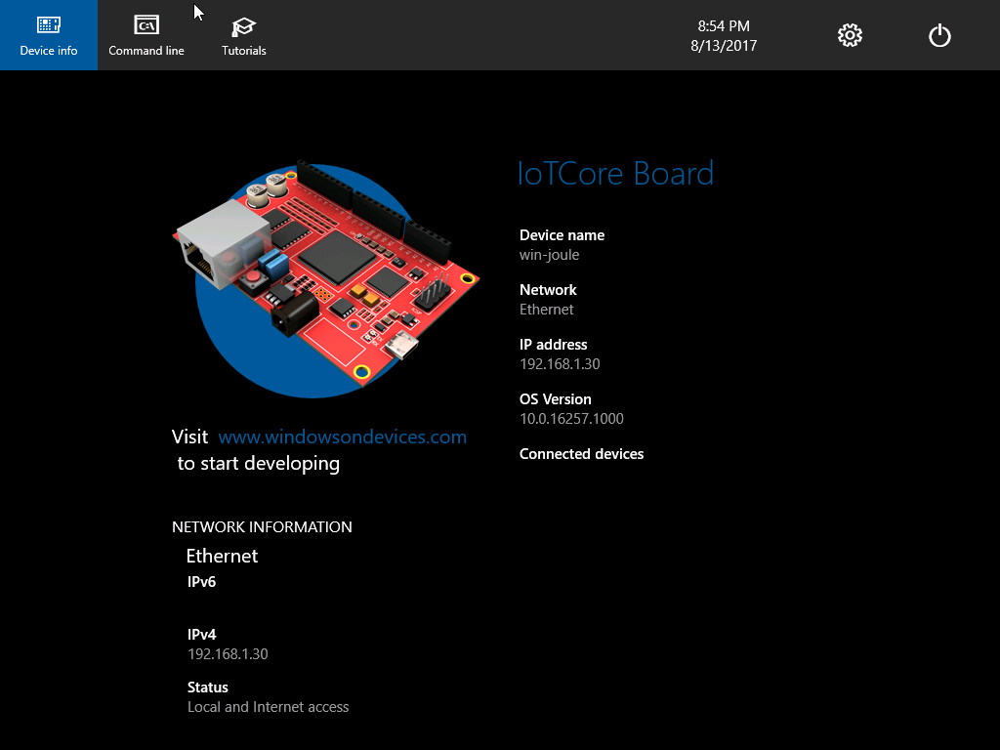

# Windows IoT On HyperV Virtual Machine

### New Virtual Hard Drive
- Create and Attach new VHD of 8GB, formatted as dynamically expanding. [According to the example](https://technet.microsoft.com/pt-br/library/gg318052(v=ws.10).aspx).
- Important: Remember the created disk number (example disk 1, disk 2, disk 3 ...)

### Image of Operational System
  - [Download and install](https://www.microsoft.com/en-us/software-download/windowsiot) Windows IoT for Intel Joule
  - Open your Command Line Tools with administrator privileges and then run the following commands:

*** Important: Replace \\\\.\PhysicalDrive1 for the number of your disk

```sh
cd "C:\Program Files (x86)\Microsoft IoT\FFU\Joule"
dism /apply-image /imagefile:flash.ffu /applyDrive:\\.\PhysicalDrive1 /skipPlatformCheck
```

- Then, dettach the disk

### Create New Virtual Machine 

- With Hyper-V enabled, open Hyper-V Manager
- Choose "Quick Create"
- In Operation System, select your VHD file
- In Network, click in "Set up automatic network"
- Click in "Create Virtual Machine"

### Done

- Run your new Windows IoT Virtual Machine



